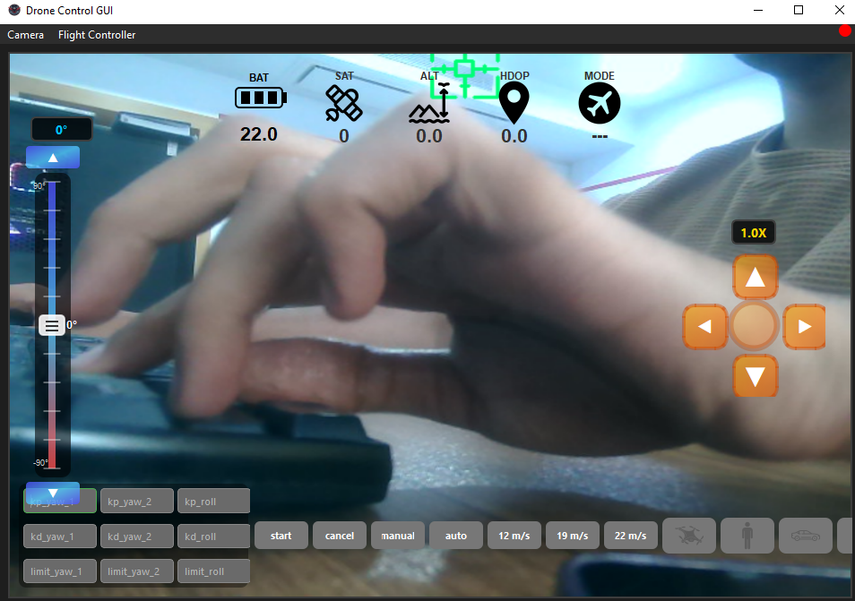

# Drone Control GUI

A PySide6-based ground control station (GCS) for a camera-equipped
drone.

The application provides a live video interface, real-time telemetry
monitoring, and operator controls for flight mode, speed, target
selection, zoom, pitch/steer angle, and PID parameters.

The system communicates with the vehicle using **MAVLink through
DroneKit**, typically over a Bluetooth serial connection to a flight
controller.

## GUI Preview



## Features

-   Live camera video streaming using OpenCV.
-   Real-time telemetry display:
    -   Battery voltage
    -   Satellite count
    -   Altitude
    -   HDOP
    -   Flight mode
-   MAVLink connection monitoring with reconnect support.
-   Flight controls:
    -   Start / Cancel commands
    -   Manual / Auto mode selection
    -   Speed selection
    -   Target selection (Person, Car, Balloon, UAV)
-   PID tuning interface.
-   Camera controls:
    -   Zoom control
    -   Pitch / steer slider
-   Runtime selection of camera and flight controller ports.

## Requirements

-   Python 3.10+
-   OpenCV-compatible webcam
-   MAVLink-compatible flight controller
-   Bluetooth or serial COM connection

## Installation

Clone the repository:

``` bash
git clone https://github.com/khosrooo/GUI_UAV.git
```

Create a virtual environment:

``` bash
python -m venv venv
```

Activate the virtual environment:

Windows:

``` bash
venv\Scripts\activate
```

Linux / macOS:

``` bash
source venv/bin/activate
```

Install dependencies:

``` bash
pip install -r requirements.txt
```

## Running
This issue happens because `collections.MutableMapping` was moved to `collections.abc.MutableMapping` in Python 3.10+.

The required change must be applied in:

`venv\Lib\site-packages\dronekit\__init__.py`

Find:

```python
class Parameters(collections.MutableMapping, HasObservers):
Start the application:
Change to:
class Parameters(collections.abc.MutableMapping, HasObservers):
```
Run this:
``` bash
python main.py
```

The application will automatically detect available cameras and attempt
to connect to the flight controller.

## Warning

Before running the application:

-   Make sure a webcam or USB camera is connected.
-   The camera must be detected by the operating system.
-   Close other applications that may already be using the camera.

If no camera is connected, the live video interface will not work
correctly.

## Notes

-   Telemetry and flight mode updates are received through a background
    MAVLink listener.
-   Qt UI updates are handled through the main GUI thread.
-   PID parameters are sent with the Start command.
-   A stable MAVLink connection is required for reliable operation.

## License

Add your preferred license here.
